##  1. 动态加载的实例 

我们在分析要爬取的网页时，先确定目标内容的加载方式。如下图所示，在**拉勾网**搜索爬虫工程师职位，点击下一页，你会发现网址栏的 url 不会变化。

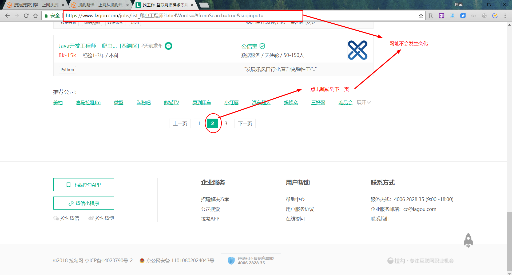

在 Chrome 浏览器左上角点击**安全**，再点击**禁止** JavaScript，**刷新**网页后发现职位信息全部被隐藏了，由此可见，职位信息是通过 异步 JavaScript 加载的。

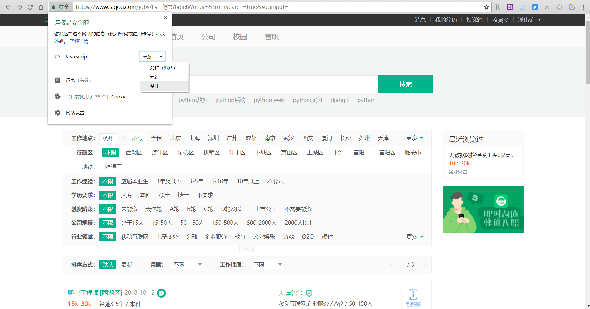

大多数网页在浏览器中展示的内容都在HTML源代码中。但是，由于主流网站都使用 JavaScript 展现网页内容，和静态网页不同的是，在使用JavaScript时，很多内容并不会出现在HTML源代码中，所以爬取静态网页的技术可能无法正常使用。

### 1.1 异步加载：

AJAX（Asynchronous Javascript And XML，异步JavaScript和XML）。它的价值在于通过在后台与服务器进行少量数据交换就可以使网页实现异步更新。这意味着可以在不重新加载整个网页的情况下对网页的某部分进行更新。一方面减少了网页重复内容的下载，另一方面节省了流量，因此AJAX得到了广泛使用。 

传统的传输数据格式方面，使用的是 XML 语法，因此叫 AJAX ,现在在数据交互上更多的是使用 JSON。

### 1.2 动态抓取网页的方式

- 通过浏览器抓包分析
- 使用 selenium + Chromedriver 模拟浏览器抓取

| 方式           |       优点       | 缺点                                 |
| :------------- | :--------------: | :----------------------------------- |
| 浏览器抓包分析 | 代码量少，效率高 | 分析结构比较费劲，复杂网站加密，难爬 |
| 通过 selenium  |       稳定       | 代码量多，性能低                     |

## 2. 通过浏览器工具抓包分析真实网页地址

第一步： 鼠标右键点击`检查`：

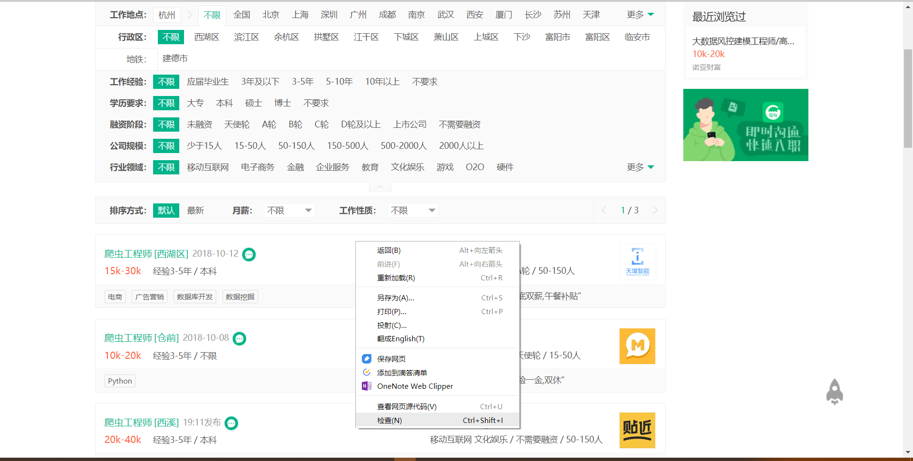

第二步： 点击 `Network`,然后刷新网页

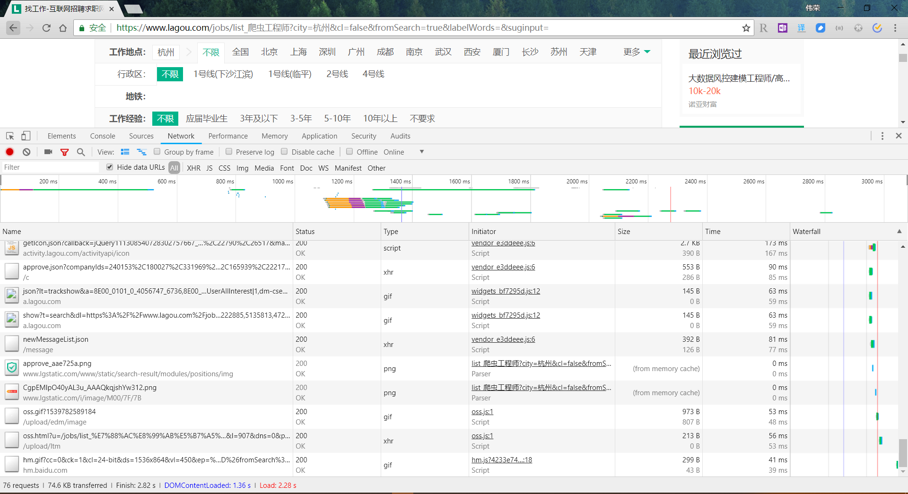

第三步： 点击`XHR`，再点击第一条内容


第四步： 点击 Preview → content →positionResult → result

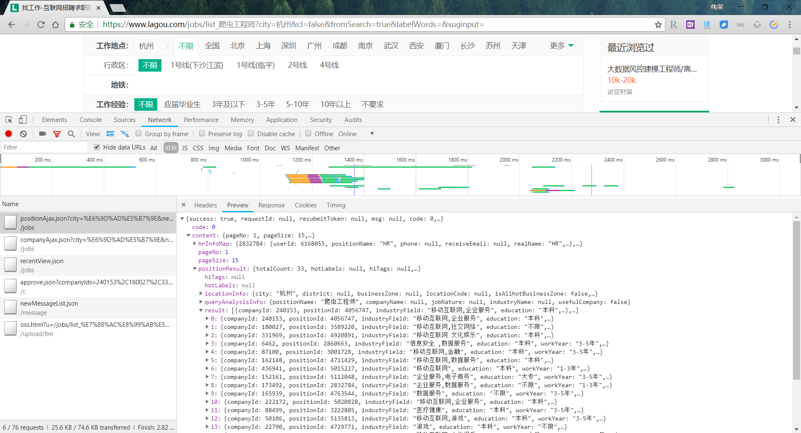

通过抓包分析，我们终于找到了要爬取的真实信息！

真实网络地址为：Request URL: 

https://www.lagou.com/jobs/positionAjax.json?city=%E6%9D%AD%E5%B7%9E&needAddtionalResult=false

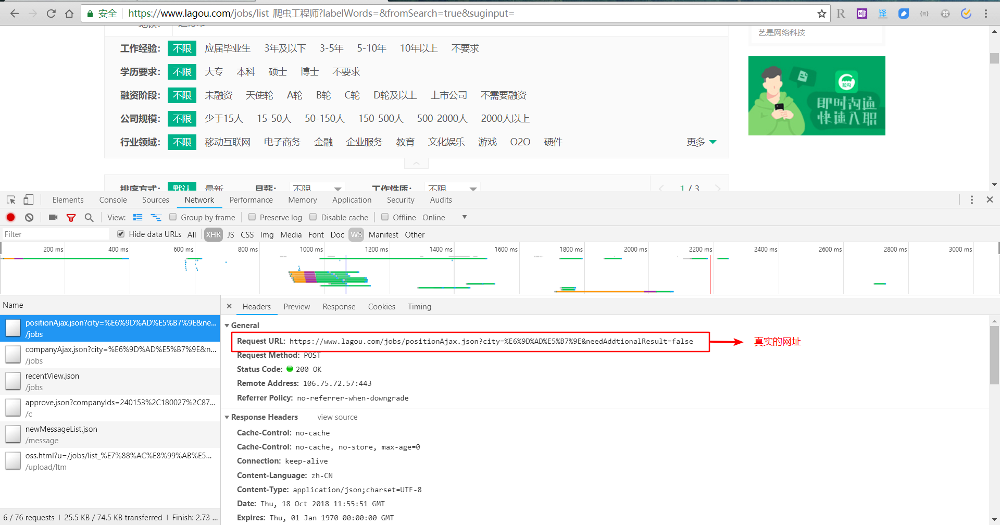

点击 Response 复制数据

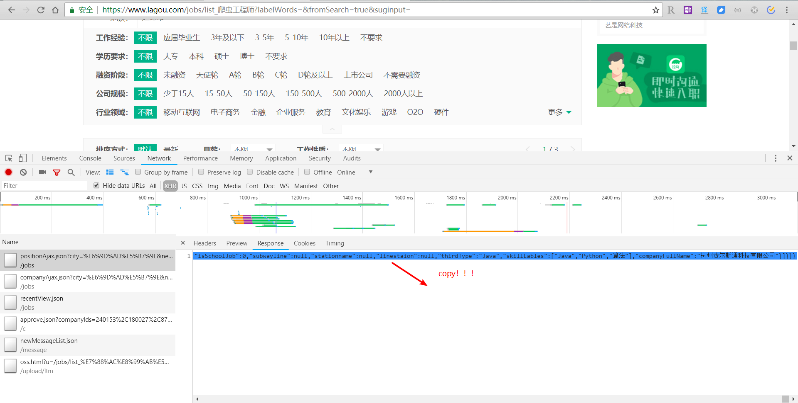

打开 https://www.json.cn/ 粘贴数据

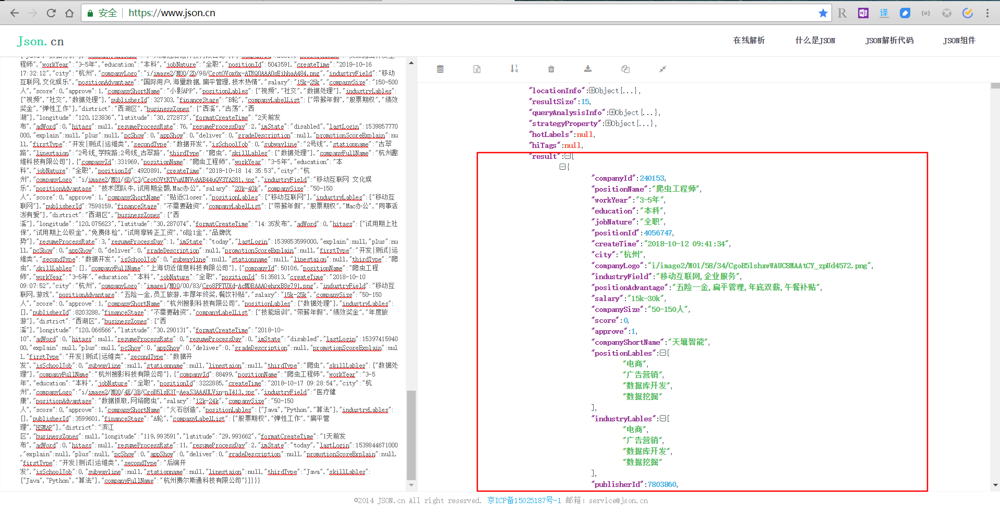

第五步： 点击`Headers` 查看 `request` 加载方式


我们可以看到 `requests` 请求方式为 `post`  ,`request`请求需要设置 `data`：

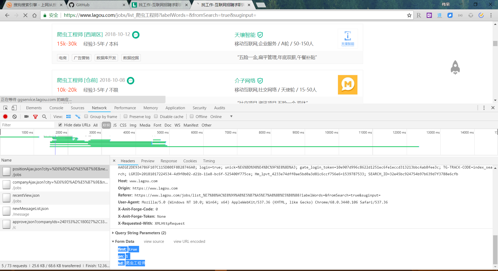

```python
data = {'first':true,
		'pn':1,
        'kd:'爬虫工程师'}
# ’first' 判断是否为网页第一页
# 'pn' 网页页码
# 'kd' 搜索的信息项
```

## 3. 通过 selenium + Chromedriver 模拟浏览器抓取

在上面的例子中，通过浏览器抓包分析，找到了真是的 request 请求地址，但是也有一些网站比较复杂，很难找到调用的网页地址，甚至有些网站会进行加密处理。为此我继续学习使用浏览器渲染引擎，直接用浏览器在显示网页时解析HTML、应用 CSS 样式并执行 JavaScript 的语句。

这个方法在爬虫过程中会打开一个浏览器加载该网页，自动操纵浏览器浏览各个网页，顺便把数据抓取下来。即使用浏览器渲染方法将爬取动态网页变成爬取静态网页。

### 3.1 selenium + Chromedriver 的介绍与安装

#### 3.1.1 什么是selenium ？

- selenium 是一个用于 web 应用程序测试的工具。 selenium 测试直接运行在浏览器中，浏览器自动按照脚本代码做出单击、输入、打开、验证等操作，就像真正的用户在操作一样。
- Chromedriver 是一个 *驱动 Chrome 浏览器* 的驱动程序，使用它才能驱动浏览器。

#### 3.1.2 安装 selenium 4步走：

##### 第一步 安装：

和其他 python 库一样通过 cmd 中 pip 安装

```python 
pip install selenium
```

##### 第二步 下载：

下载[Chromedriver](http://npm.taobao.org/mirrors/chromedriver/2.33/)，解压后放在环境变量的 path 中，在 Windows 系统中可以将其下载后放在 Anaconda 的安装地址中，如 C:\Users\weiro\Anaconda3\Scripts 为我的安装地址。

##### 第三步 设置环境变量：

- 如图打开系统属性页面

  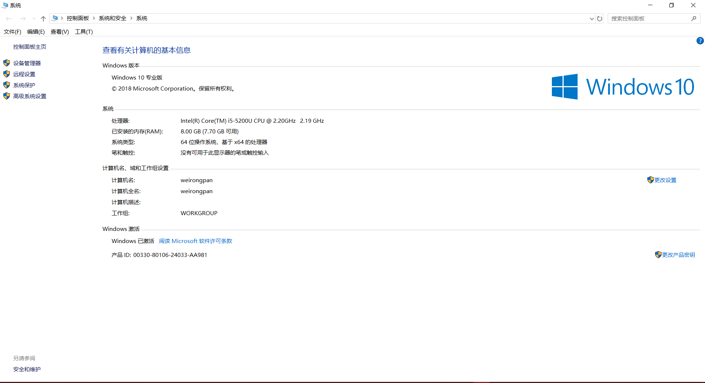

- 点击高级系统设置

  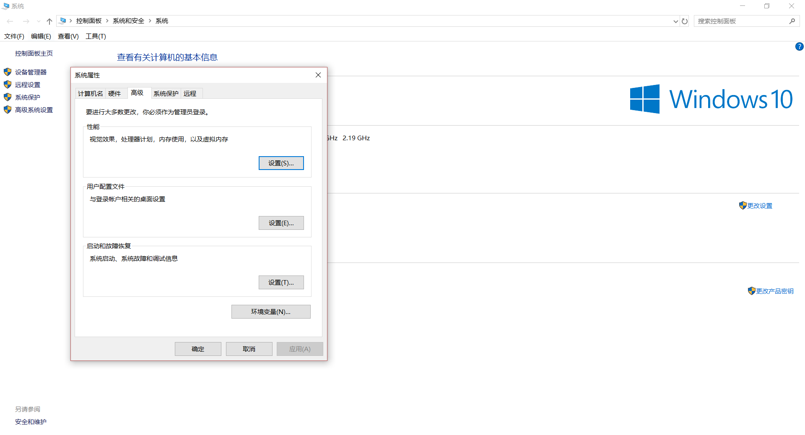

- 点击环境变量,选中 path , 点击编辑

  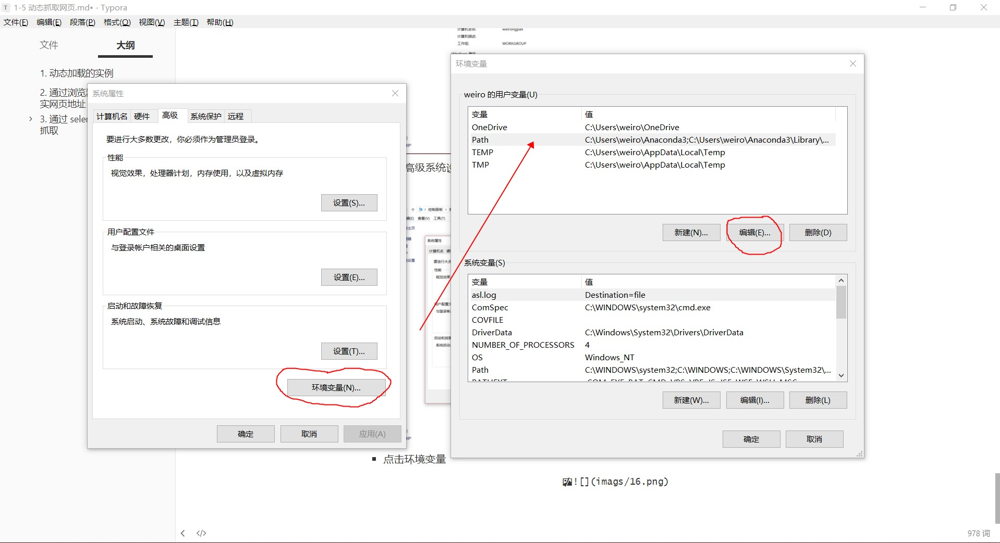

- 在编辑环境变量页面，点击新建，复制 Anaconda 的安装地址,点击确定。如下图，我已经将目录 copy 到 环境变量的 path 中。

  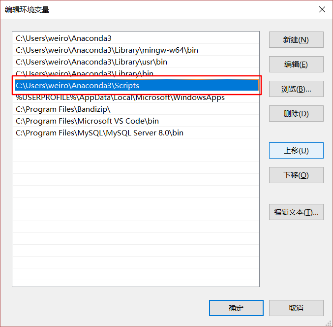

##### 第四步:使用代码进行测试

```python
from selenium import webdriver       # 导入包
driver = webdriver.Chrome()          # 打开 Chrome 浏览器
driver.get('https://www.sogou.com/') # 打开搜狗搜索引擎首页
print(driver.page_source)            # 获取网页源代码
```

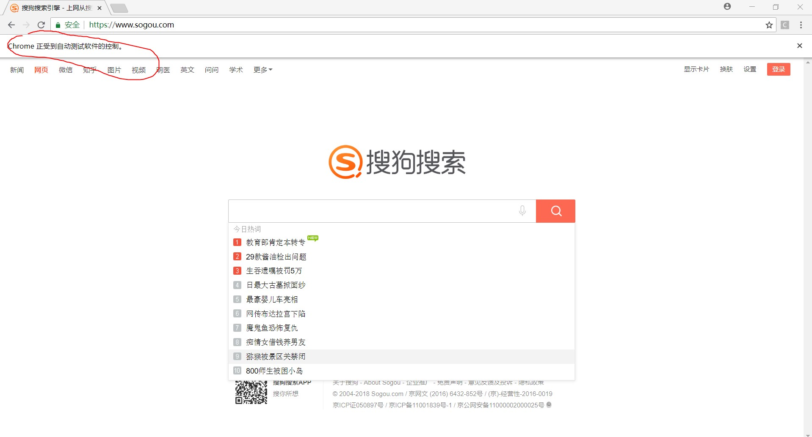

### 3.2 selenium 常用操作

#### 3.2.1 关闭页面：

- driver.close()  关闭当前页面；

- driver.quit()  退出整个浏览器。

  ```python
  from selenium import webdriver       # 导入包
  import time
  driver = webdriver.Chrome()          # 打开 Chrome 浏览器
  driver.get('https://www.baidu.com/') # 打开百度搜索引擎首页
  time.sleep(10)
  driver.close() # 关闭当前网页
  time.sleep(5)
  driver.quit() # 退出整个浏览器
  ```


#### 3.2.2 定位元素 

以搜狗搜索主页 https://www.sogou.com/ 为例，要使用 selenium 自动打开 Chrome 浏览器 并在输入框中输入 `爬虫`，并搜索。

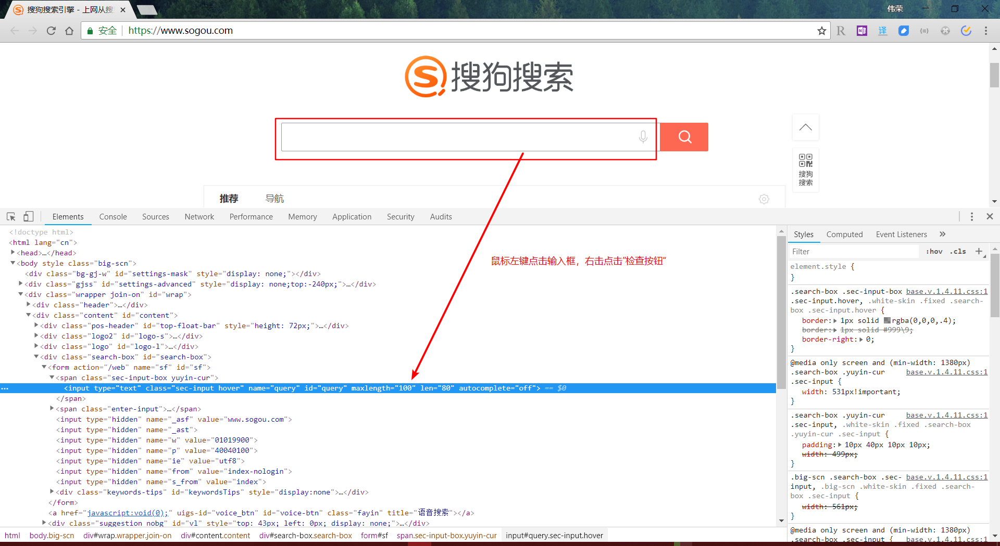

##### ① find_element_by_id 根据 id 来查找某个元素。

```python 
# 导入包
from selenium import webdriver
# 初始化 driver
driver = webdriver.Chrome()
url = 'https://www.sogou.com/'
# 打开 url
driver.get(url)
# 根据 id 查找某个元素
inputTag = driver.find_element_by_id('query')
"""
# 等价写法
from selenium.webdriver.common.by import By
inputTag = driver.find_element(By.ID,'query')
"""
# 搜索 “爬虫”
inputTag.send_keys('爬虫')
submitTag = driver.find_element(By.ID,'su')
```

##### ② find_element_by_class_name 根据类名来查找元素

```python
# 导入包
from selenium import webdriver
# 初始化 driver
driver = webdriver.Chrome()
url = 'https://www.sogou.com/'
# 打开 url
driver.get(url)
# 根据 类名 查找某个元素
inputTag = driver.find_element_by_class_name('sec-input')
# 搜索 “爬虫”
inputTag.send_keys('爬虫')
```

##### ③ find_element_by_name 根据 name 属性的值来查找元素

```python
# 导入包
from selenium import webdriver
# 初始化 driver
driver = webdriver.Chrome()
url = 'https://www.baidu.com/'
# 打开 url
driver.get(url)
# 根据 name 属性值查找某个元素
inputTag = driver.find_element_by_name('wd')
# 搜索 “爬虫”
inputTag.send_keys('爬虫')
```

##### ④ find_element_by_tag_name 根据标签名来查找元素

```python
# 导入包
from selenium import webdriver
# 初始化 driver
driver = webdriver.Chrome()
# 打开url
driver.get(url)
# 根据标签名来查找元素
driver.find_element_by_tag_name('div')
```

##### ⑤ find_element_by_xpath 根据 xpath 语法来获取元素

```python
# 导入包
from selenium import webdriver
# 初始化 driver
driver = webdriver.Chrome()
url = 'https://www.baidu.com/'
# 打开 url
driver.get(url)
# 根据 xpath 值查找某个元素
inputTag = driver.find_element_by_xpath('//*[@id="kw"]')
# 搜索 “爬虫”
inputTag.send_keys('爬虫')
```

##### ⑥ find_element_by_css_selector 根据 css 选择器选择元素

```python
# 导入包
from selenium import webdriver
# 初始化 driver
driver = webdriver.Chrome()
url = 'https://www.baidu.com/'
# 打开 url
driver.get(url)
# 根据 css 选择器 查找某个元素
inputTag = driver.find_element_by_css_selector('#kw')
# 搜索 “爬虫”
inputTag.send_keys('爬虫')
```

##### ==注意==

1. find_element 是获取第一个满足条件的元素， find_element**s** 是获取所有满足条件的元素

2.  如果只想要解析网页中的数据，那么推荐奖网页源代码 `driver.page_source` 扔给 `lxml`解析，因为 `lxml`底层使用的是 c 语言，所以解析效率会更高。

   尝试爬取拉勾网`数据分析师`岗位信息中的`公司名`。

   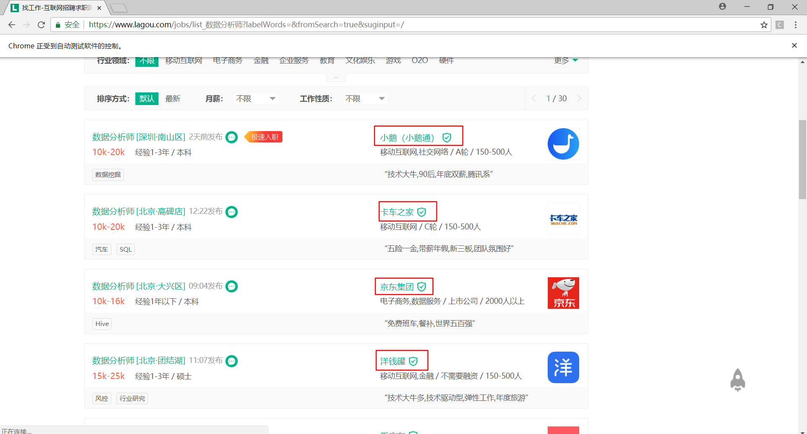

```python
# 爬取拉勾网数据分析师岗位信息中的公司名

# 导入包
from selenium import webdriver
from lxml import etree
# 初始化 driver
driver = webdriver.Chrome()
url = 'https://www.lagou.com/jobs/list_%E6%95%B0%E6%8D%AE%E5%88%86%E6%9E%90%E5%B8%88?labelWords=&fromSearch=true&suginput=/'
# 打开 url
driver.get(url)
html = driver.page_source
print(html)

xml = etree.HTML(html)
company_names = xml.xpath('//*[@id="s_position_list"]/ul/li/div[1]/div[2]/div[1]/a/text()')
i=1
for company_name in company_names:
    print(i)
    print(company_name)
    i+=1
```

3.  如果想要对元素进行一些操作，比如给一个文本框输入值，或者是点击某个按钮，那么就必须使用 `selenium`提供给我们的查找元素的方法 `driver.find_element_by_……`

#### 3.2.3 操作表单元素

##### ① 操作输入框：

分为两步。第一步，找到这个元素。第二步：使用 `send_keys(value)`,将数据填充进去。如百度的搜索框。


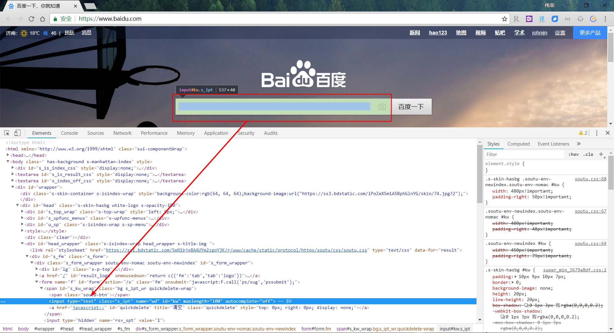

```python
inputTag = driver.find_element_by_id('kw')
inputTag.send_keys('数据分析师')
```

使用`.clear()`方法可以清楚输入框中的内容

```python
# 导入包
from selenium import webdriver
import time
# 初始化 driver
driver = webdriver.Chrome()
url = 'https://www.baidu.com/'
# 打开 url
driver.get(url)
# 定位
inputTag = driver.find_element_by_id('kw')
# 输入
inputTag.send_keys('学习Python')
# 持续时间
time.sleep(6)
# 清空
inputTag.clear()
```

##### ② 操作 checkbox： 

因为要选中`checkbox`标签，在网页中是通过鼠标点击的，因此想要选中 `checkbox`标签，应先定位到该标签，再执行`click`事件。

`type="checkbox"`

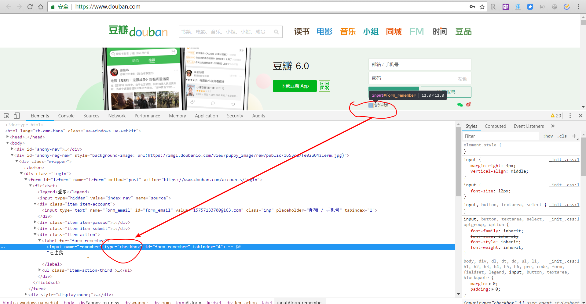

```python
# 导入包
from selenium import webdriver
import time
# 初始化 driver
driver = webdriver.Chrome()
url = 'https://www.douban.com/'
# 打开 url
driver.get(url)
# 定位
remember_btn = driver.find_element_by_id('form_remember')
# 勾选
remember_btn.click()
# 持续时间
time.sleep(6)
# 取消勾选
remember_btn.click() 
```

##### ③ 选择 select：

**下拉列表** select 元素不能直接点击，因为点击后还需要选中元素。因此 selenium 专门为 select 标签提供了一个类： `selenium.webdriver.support.ui.Select`。将获得的元素当成参数传到这个类中，创建这个对象，然后就可以使用这个对象进行选择了。[潍坊公积金网站](http://www.wfgjj.gov.cn/)就存在这种元素。

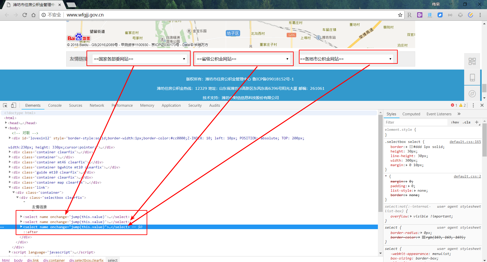

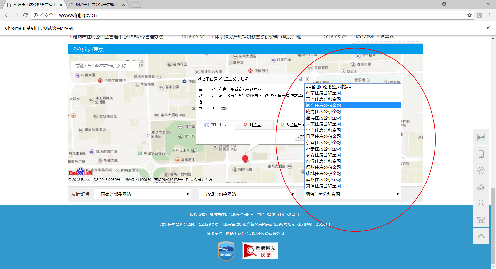

示例代码：

```python
# 导入包
from selenium import webdriver
from selenium.webdriver.support.ui import Select
import time
# 初始化 driver
driver = webdriver.Chrome()
url = 'http://www.wfgjj.gov.cn/'
# 打开 url
driver.get(url)
# 选中这个标签然后使用 Select 创建对象
selectTag = Select(driver.find_element_by_xpath('/html/body/div[9]/div/div/select[3]'))
# 根据可视文本选择 访问 烟台住房公积金网
selectTag.select_by_visible_text('烟台住房公积金网')
time.sleep(5)
# 根据索引选择 访问 威海住房公积金网
selectTag.select_by_index(4)
time.sleep(5)
# 根据值选择 访问 青岛住房公积金网
selectTag.select_by_value('http://www.qdgjj.com/')
# 取消选中所有项
selectTag.deselect_all()
```

##### ④ 操作按钮：

操作按钮有很多种方式。如单击、右击、双击等。

鼠标左键单击直接调用`click`函数就可以了。

```python
# 导入包
from selenium import webdriver
import time
# 初始化driver
driver = webdriver.Chrome()
# 打开网页
driver.get('https://www.sogou.com/')
# 定位搜索框
inputTag = driver.find_element_by_id('query')
# 输入要查询的内容
inputTag.send_keys('今日天气')
# 定位搜索按钮
clickBtn = driver.find_element_by_id('stb')
# 等待
time.sleep(3)
# 点击搜索
clickBtn.click()
```

#### 3.2.4 行为链

有时候在页面中操作，可能需要很多步，那么这时候可以使用鼠标行为链类`ActionChains`l来完成。比如现在要将鼠标移动到某个元素上并执行点击事件。

```python
from selenium import webdriver
from selenium.webdriver.common.action_chains import ActionChains

driver = webdriver.Chrome()
driver.get('https://www.sogou.com/')

inputTag = driver.find_element_by_id('query')
subTag = driver.find_element_by_id('stb')

actions = ActionChains(driver)
actions.move_to_element(inputTag)
actions.send_keys_to_element(inputTag,'今日农历')

actions.move_to_element(subTag)
actions.click(subTag)

actions.perform()
```

==还有更多的鼠标相关操作：==

- click_and_hold(element) 点击但不松开鼠标
- context_click(element) 右键点击
- doubl_click(element)  双击

#### 3.2.5 Cookie 操作

##### ① 获取所有的 cookie

```python
from selenium import webdriver

driver = webdriver.Chrome()
driver.get('https://www.sogou.com/')

for cookie in driver.get_cookies():
    print(cookie)
```

##### ② 根据cookie 的 key 获取 value

```python
from selenium import webdriver

driver = webdriver.Chrome()
driver.get('https://www.sogou.com/')

for cookie in driver.get_cookies():
    print(cookie)

print('**'*18)
print(driver.get_cookie('osV'))
```

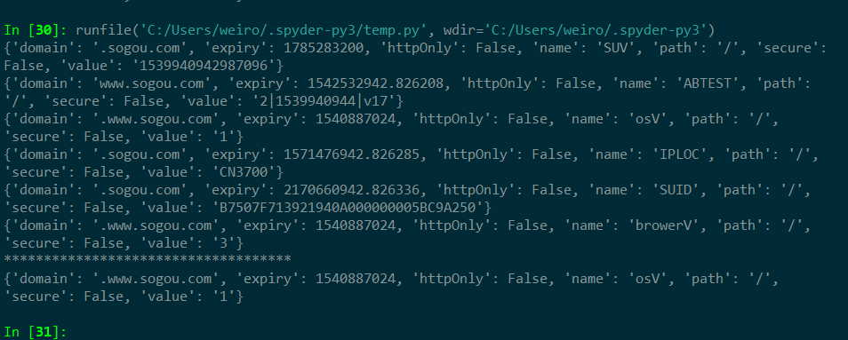

##### ③ 删除某个 cookie

```python
from selenium import webdriver

driver = webdriver.Chrome()
driver.get('https://www.sogou.com/')
# 获取所有的 cookie
for cookie in driver.get_cookies():
    print(cookie)
# 根据cookie 的 key 获取 value
print('**'*28)
print(driver.get_cookie('osV'))
print('**'*28)
# 删除某一特定的cookie
driver.delete_cookie('osV')
print(driver.get_cookie('osV'))
```

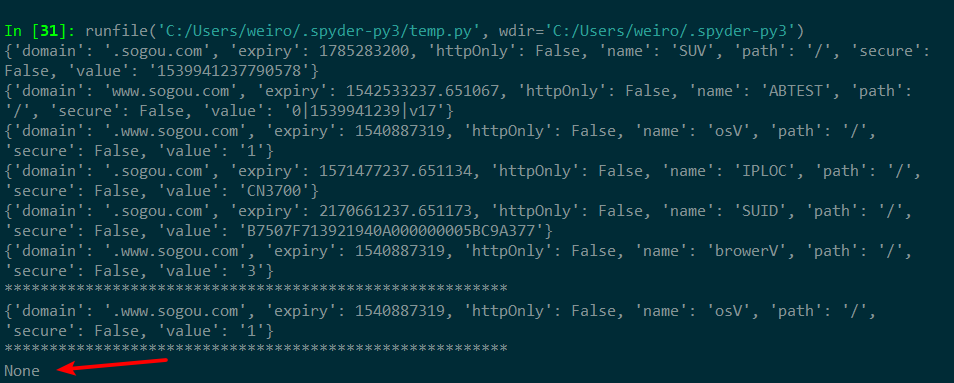

##### ④ 删除所有的 cookie

```python
# 删除所有的cookie
driver.delete_all_cookies()
```

#### 3.2.6 页面等待


 


